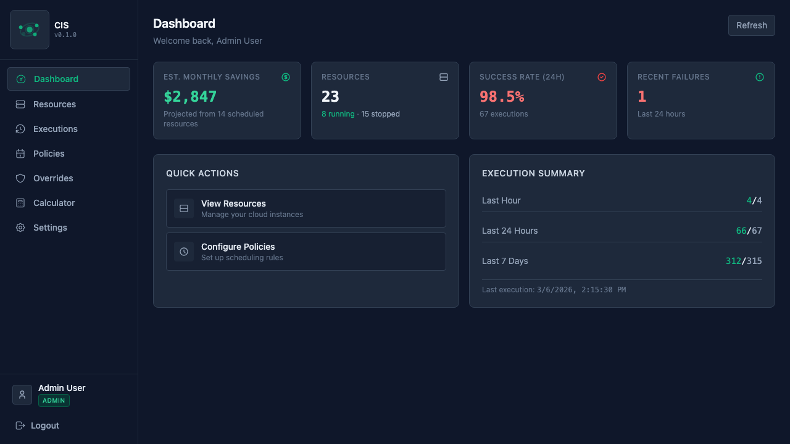

<p align="center">
  
</p>

# Cloud Instance Scheduler (CIS)

[](https://github.com/estemendoza/cloud-instance-scheduler/actions/workflows/ci.yml)
[](LICENSE)
[](https://www.python.org/downloads/)
[](https://estemendoza.github.io/cloud-instance-scheduler/)

**Save 40-65% on cloud compute — automatically.**

Most cloud instances don't need to run 24/7. Development, staging, and test environments sit idle nights, weekends, and holidays — but you keep paying for them.

CIS lets you define schedules for your AWS, Azure, and GCP instances. It handles the start/stop automation, tracks every action, and gives you a clear view of your savings. No agents to install, no code changes — just connect your cloud accounts and set your policies.

<p align="center">
  
</p>

## Features

- Connect AWS, Azure, and GCP accounts and auto-discover compute instances
- Define timezone-aware schedules using a visual weekly grid or cron expressions
- Apply temporary per-resource overrides when you need an instance outside its schedule
- Track savings estimates and explore what-if scenarios with the cost calculator
- User management with roles and API key authentication
- Full execution history and state transition audit log
- Self-hosted — runs on your infrastructure

## Why Not Use Native Scheduling?

Each cloud provider offers some form of instance scheduling, but the solutions are fragmented, provider-specific, and often surprisingly complex:

| | AWS | Azure | GCP | CIS |
|---|---|---|---|---|
| **Setup** | Deploy CloudFormation stack with Lambda, DynamoDB, EventBridge, and IAM roles | Deploy Azure Functions + 5 Logic Apps + Application Insights + Storage Account | Create resource policies per region or deploy Cloud Functions + Pub/Sub + Cloud Scheduler | Connect cloud account, create a policy |
| **Start + Stop** | Yes | Built-in auto-shutdown is stop-only; start requires the full Start/Stop VMs v2 deployment | Yes (Instance Schedules) | Yes |
| **Multi-cloud** | No | No | No | Yes — one dashboard for all three |
| **Cross-account** | Requires additional configuration per account | Requires Owner permission on each subscription | Schedules are per-region, per-project | Add accounts, assign policies |
| **Scheduling flexibility** | Schedules defined in DynamoDB with periods and time zones | JSON payloads in Logic Apps | Cron expressions in resource policies, limited to one schedule per VM | Visual weekly grid or cron expressions with timezone support |
| **Override support** | Manual tag manipulation | Manual intervention | Manual intervention | Built-in per-resource overrides with expiration |
| **Savings visibility** | No | No | No | Savings tracking and cost calculator |
| **Infrastructure to maintain** | Lambda functions, DynamoDB tables, CloudWatch metrics | Azure Functions, Logic Apps, Application Insights | Cloud Functions, Pub/Sub topics, Scheduler jobs (if not using Instance Schedules) | Single self-hosted app |
| **Typical infra cost** | ~$5/month | ~$6/month per VM managed | Free (Instance Schedules) or minimal | Self-hosted |

The core problem: if you use more than one cloud provider, you're managing completely separate scheduling systems with different configuration models, no unified view, and no way to track overall savings.

> **Full documentation** — installation guides, configuration reference, architecture details, and more at [estemendoza.github.io/cloud-instance-scheduler](https://estemendoza.github.io/cloud-instance-scheduler/).

## Prerequisites

Recommended (quickest path):

- Docker
- Docker Compose

Optional local development:

- Python 3.11
- Poetry 2.x
- Node.js 20+
- PostgreSQL 15+

## Quick Start (Docker)

1. Create environment file:

```bash
cp .env.production.example .env
```

2. Set required secrets in `.env`:

- `ENCRYPTION_KEY`
- `JWT_SECRET_KEY`
- `POSTGRES_PASSWORD`

You can generate secure keys with:

```bash
openssl rand -hex 32
```

3. Start services:

```bash
docker compose up --build -d
```

4. Create database tables:

```bash
docker compose exec app alembic upgrade head
```

5. Open:

- Frontend: `http://localhost:3000`
- API root: `http://localhost:8000`
- OpenAPI docs: `http://localhost:8000/api/v1/docs`

## Production Deployment (Pre-built Images)

Pre-built images are available on Docker Hub for deploying without building from source.

### Images

| Image | Description |
|-------|-------------|
| `estemendoza/cis:api-latest` | Backend API (FastAPI + Uvicorn) |
| `estemendoza/cis:frontend-latest` | Frontend (SvelteKit pre-built + nginx) |

Versioned tags are also available: `estemendoza/cis:api-v1.0.0`, `estemendoza/cis:frontend-v1.0.0`.

### Deploy with Docker Compose

1. Copy the deployment compose file and environment template to your server:

```bash
curl -O https://raw.githubusercontent.com/estemendoza/cis/main/docker-compose.deploy.yml
curl -O https://raw.githubusercontent.com/estemendoza/cis/main/.env.production.example
cp .env.production.example .env
```

2. Edit `.env` with your production values:

```bash
# Generate secure keys
ENCRYPTION_KEY=$(python3 -c "from cryptography.fernet import Fernet; print(Fernet.generate_key().decode())")
JWT_SECRET_KEY=$(openssl rand -hex 32)
POSTGRES_PASSWORD=$(openssl rand -hex 16)
```

3. Start services:

```bash
docker compose -f docker-compose.deploy.yml up -d
```

4. Run database migrations:

```bash
docker compose -f docker-compose.deploy.yml run --rm app alembic upgrade head
```

5. Access the application:

- Frontend: `http://your-server:3000`
- API: `http://your-server:8000`

### Architecture

The production deployment uses three containers:

- **frontend** (nginx) — Serves the pre-built SvelteKit app and proxies `/api` requests to the backend
- **app** (uvicorn) — FastAPI backend, runs the scheduler in-process
- **db** (postgres:15-alpine) — PostgreSQL database with a persistent volume

### Updating

```bash
# 1. Pull new images (existing containers keep running)
docker compose -f docker-compose.deploy.yml pull

# 2. Run migrations using the new image (one-off container)
docker compose -f docker-compose.deploy.yml run --rm app alembic upgrade head

# 3. Restart services with the new images
docker compose -f docker-compose.deploy.yml up -d

# 4. Clean up old images
docker image prune -f
```

## Configuration

Key environment variables:

- `POSTGRES_SERVER`
- `POSTGRES_PORT`
- `POSTGRES_USER`
- `POSTGRES_PASSWORD`
- `POSTGRES_DB`
- `ENCRYPTION_KEY` (required for cloud credential encryption/decryption)
- `JWT_SECRET_KEY` (required for JWT signing/validation)
- `PRICING_UPDATE_HOUR_UTC`
- `PRICING_UPDATE_MINUTE_UTC`
- `CORS_ALLOW_ALL_ORIGINS` (use with care in production)
- `DISABLE_DOCS` (set `True` to hide OpenAPI docs in production)

Use `.env.example` or `.env.production.example` as reference templates.

## Run Locally Without Docker (Optional)

### Backend

1. Install dependencies:

```bash
poetry install
```

2. Configure `.env` for your local PostgreSQL.

3. Run migrations:

```bash
poetry run alembic upgrade head
```

4. Start API:

```bash
poetry run uvicorn app.main:app --reload --host 0.0.0.0 --port 8000
```

### Frontend

```bash
cd frontend
npm ci
npm run dev
```

Frontend runs on `http://localhost:3000`.

## Testing

Run all tests:

```bash
poetry run pytest
```

Coverage is enabled by default via pytest config. Running `pytest` generates:

- `coverage.xml`
- `pytest-results.xml`

Test suites:

- `tests/unit`
- `tests/services`
- `tests/providers`
- `tests/integration`

## API Overview

- Base URL: `/api/v1`
- Interactive docs: `/api/v1/docs`
- ReDoc: `/api/v1/redoc`

Authentication modes:

- JWT Bearer token: `Authorization: Bearer <token>`
- API key: `X-API-Key: <key>`

Auth resolution order is JWT first, API key fallback.

## Security

CIS holds your cloud provider credentials and controls production infrastructure — security isn't optional. Unlike most scheduling tools that treat it as an afterthought, CIS is built with a defense-in-depth approach so your AWS, Azure, and GCP accounts stay protected.

### Credential Protection

- All cloud credentials are encrypted at rest using Fernet symmetric encryption before being stored in the database
- Credentials are never returned in API responses — they are only decrypted server-side when making cloud API calls
- The encryption key (`ENCRYPTION_KEY`) lives outside the database as an environment variable, so a database compromise alone does not expose secrets
- Set a strong, unique `ENCRYPTION_KEY` and `JWT_SECRET_KEY` before deploying (see Quick Start)

### Authentication & Access Control

- Dual authentication: JWT tokens for browser sessions, hashed API keys for programmatic access
- API keys are stored as bcrypt hashes — plaintext keys are shown once at creation and never stored
- Role-based access control with three roles: **admin**, **operator**, and **viewer**, enforced on every endpoint
- API keys expire after 90 days by default, with dashboard warnings as expiry approaches
- Bootstrap endpoints (for first-time setup) are locked down after initial use

### Infrastructure Hardening

- Security headers on all responses: `X-Content-Type-Options`, `X-Frame-Options`, `Referrer-Policy`, `Permissions-Policy`, and `Strict-Transport-Security` (HTTPS)
- Request size limits (10 MB) to prevent oversized payload abuse
- Rate limiting on authentication and other sensitive endpoints to slow down brute-force attempts
- Permission errors return generic messages — no role names, permissions, or internal details are leaked

### Audit Logging

- All security-relevant actions are logged: logins, failed login attempts, API key creation and deletion, user management, and credential changes
- Audit log API available to admins with filtering by event type and resource
- Each log entry captures IP address, user agent, endpoint, and timestamp for forensic review

## Schedule Types

Each policy uses one of two schedule formats:

### Weekly Grid

A visual grid where you select time windows per day of the week. Best for regular business-hours patterns.

```json
{
  "schedule_type": "weekly",
  "schedule": {
    "monday": [{"start": "09:00", "end": "18:00"}],
    "tuesday": [{"start": "09:00", "end": "18:00"}],
    "wednesday": [{"start": "09:00", "end": "18:00"}],
    "thursday": [{"start": "09:00", "end": "18:00"}],
    "friday": [{"start": "09:00", "end": "18:00"}]
  }
}
```

### Cron Expressions

Two cron expressions define when instances should start and stop. Best for schedules that don't fit a simple weekly pattern.

```json
{
  "schedule_type": "cron",
  "schedule": {
    "start": "0 9 * * 1-5",
    "stop": "0 18 * * 1-5"
  }
}
```

Standard 5-field cron syntax: `minute hour day-of-month month day-of-week`

Common patterns:
- `0 9 * * 1-5` — 9:00 AM, Monday through Friday
- `0 22 * * *` — 10:00 PM, every day
- `0 8 * * 1-5` — 8:00 AM, weekdays only

The UI provides preset buttons for common schedules and validates cron syntax before saving.

## Current Limitations

- Scheduler runs in-process in the API app; multi-replica deployments need a leader/lock strategy.
- Savings pricing coverage is strongest for AWS; Azure/GCP pricing parity is not complete.
- API key lookup uses prefix + bcrypt verification loop, which is simple but not optimized for very large key volumes.
